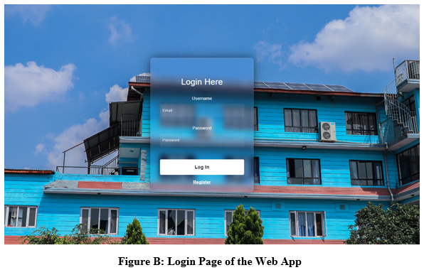
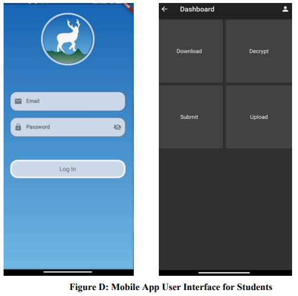

# FinalYearProject

A blockchain-based portal which allows teacher to upload question paper which is then encrypted using AES and stored in IPFS which checks the authenticity and hash key of the file sent by the students with the help of Java web framework Spring Boot.

A system which allows students to download the question paper beforehand and submit their answer sheets without the need of valid internet connection. Built using Firebase and Flutter

  

  

  

  

  

